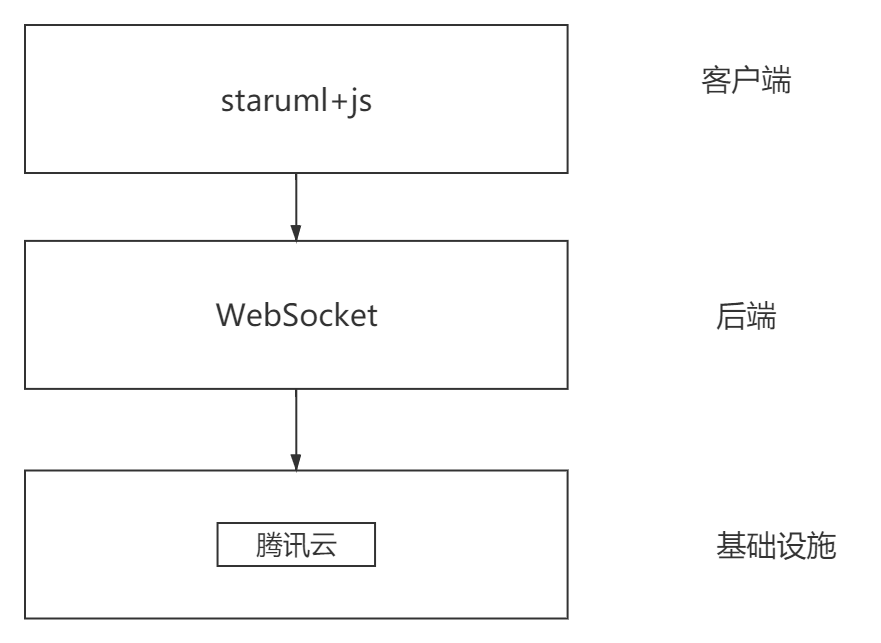
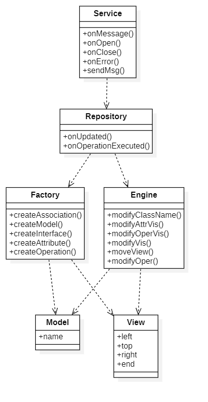

#详细设计
##1 架构设计

##2 类设计

###2.1 Service类
####2.1.1 功能描述
&nbsp;&nbsp;与服务器进行交互，对收到的信息进行处理
####2.1.2 程序描述
```js
var socket_ip='121.4.81.114'
		
  socket= new WebSocket('ws://'+socket_ip+':8092')

  socket.onopen = function(event)
  {
    sendMsg('{"msg":"连接成功！"}')
  }
  // 监听消息
  socket.onmessage = function(event)
  {
    console.log('Client received a message',event)
    var msg=JSON.parse(event.data.substr(5))
    console.log(msg)
    if(msg.event==='UMLClassCreated'){
      createClass=0
      createModel(msg)
    }else if(msg.event==='UMLInterfaceCreated'){
      createClass=0
      createInterface(msg)
    }
    else if(msg.event==='emendAttrOrOper'){
      update=0
      updateModel(msg)
    }else{
      op=0
      if(msg.event==='modifyClassName'){
        modifyClassName(msg)
      }else if(msg.event==='modifyAttr'){
        modifyAttr(msg)
      }else if(msg.event==='modifyOper'){
        modifyOper(msg)
      }else if(msg.event==='changeVis'){
        modifyVis(msg)
      }else if(msg.event==='moveView'){
        moveView(msg)
      }else if(msg.event==='resizeNode'){
        resizeView(msg)
      }
    }
  }

  // 监听Socket的关闭
  socket.onclose = function(event)
  {
    console.log('连接已经断开')
  }

  socket.onerror = function(event) {
    alert('无法连接到:' + socket_ip);
  }
}

function sendMsg(msg){
  socket.send(msg); 
```
###2.2 Repository类
####2.2.1 功能描述 进行对应事件的监听和逻辑的执行
####2.2.2 程序描述
```js
//点击创建/删除属性或接口按钮事件,修改类名称时也会触发，但是综合考虑不在这里做处理
  app.repository.on('updated',function(updatedElems){
    if(update==0){
      update=1
      return
    }
    var flag=false,obj=new Object(),name
    for(i=0;i<updatedElems.length;i++){
      if(updatedElems[i].getDisplayClassName()==='Class'||updatedElems[i].getDisplayClassName()==='Interface'){
        name=updatedElems[i].name
        flag=true
        break
      }
    }
    //更新的element数组里没有类型为Class的元素，返回
    if(!flag){
      return
    }
    var diagram=app.diagrams.getCurrentDiagram()
    var views=diagram.ownedViews
    for(i=0;i<views.length;i++){
      var view=views[i]
      if(view.model.name===name){
        console.log(name)
        var attributes=[],operations=[]
        for(j=0;j<view.model.attributes.length;j++){
          attributes.push(view.model.attributes[j].name)
        }
        for(j=0;j<view.model.operations.length;j++){
          operations.push(view.model.operations[j].name)
        }
        obj.event='emendAttrOrOper'
        obj.name=name
        obj.attributes=attributes
        obj.operations=operations
        var json=JSON.stringify(obj)
        sendMsg(json)
        console.log(json)
      }
    }
  })
//修改类名称或者编辑属性或接口名称事件
  app.repository.on('operationExecuted',function(operation){
    if(op===0){
      op=1
      return
    }
    var obj=new Object()
    var parentName=app.selections.getSelectedModels()[0]._parent.name
    var currName=app.selections.getSelectedModels()[0].name
    console.log(operation)
    if(operation.ops[0].arg.f==='visibility'){
      obj.event='changeVis'  
      obj.className=parentName
      obj.name=currName
      obj.old=operation.ops[0].arg.o
      obj.new=operation.ops[0].arg.n
      console.log(obj)
    }
    else if(operation.name=='change properties'){
      if(parentName=='Model'){
        obj.event='modifyClassName'
      }else{
        obj.event='modifyAttr'
        obj.className=parentName
      }
      obj.old=operation.ops[0].arg.o
      obj.new=operation.ops[0].arg.n
    }
    else if(operation.name=='change operation'){
      obj.event='modifyOper'
      obj.className=parentName
      obj.field=operation.ops[0].arg.f
      obj.old=operation.ops[0].arg.o
      obj.new=operation.ops[0].arg.n
    }
    else if(operation.name=='move views'){
      obj.event='moveView'
      obj.className=currName
      obj.newLeft=operation.ops[0].arg.n-operation.ops[0].arg.o
      obj.newTop=operation.ops[1].arg.n-operation.ops[1].arg.o
    }
    else if(operation.name=='resize node'){
      obj.event='resizeNode'
      obj.className=currName
      obj.newWidth=operation.ops[0].arg.n
      obj.newHeight=operation.ops[1].arg.n
    }
    if(operation.name!='add model'&&operation.name!='Create Class'){
      var json=JSON.stringify(obj)
      sendMsg(json)
      console.log(json)
    }
  })
```
### 2.3 Factory类
####2.3.1 概要描述
负责对各种元素进行生成
####2.3.2 程序描述
```js
//创建链接,注意head才是目标，tail才是出发点
function createAssociation(headName,tailName,name){
    var diagram=app.diagrams.getCurrentDiagram()
    var views=diagram.ownedViews
    var headClassView,tailClassView
    for(i=0;i<views.length;i++){
      var view=views[i]
      if(view.model.name===headName){
        headClassView=view
      }else if(view.model.name===tailName){
        tailClassView=view
      }
    }
    var options3 = {
      id: 'UMLAssociation',
      parent: diagram._parent,
      diagram: diagram,
      tailView: tailClassView,
      headView: headClassView,
      //headEndStyle:1, //这个属性是决定是否有箭头的关键属性 但是设置操作无效
      tailModel: tailClassView.model,
      headModel: headClassView.model
    }
    var associationView=app.factory.createModelAndView(options3)
    associationView.model.name=name
    //associationView.headEndStyle=1  //这个属性是决定是否有箭头的关键属性 但是设置操作无效
    console.log(associationView.headEndStyle)
    moveView('Class1',tailClassView.left-10,tailClassView.top)
    moveView('Class1',tailClassView.left+10,tailClassView.top)
}
function createAttribute (name,model) {
  var attr = app.factory.createModel({ id: "UMLAttribute", parent: model, field: "attributes" })
  attr.name=name
}

function createOperation (name,model) {
  var oper = app.factory.createModel({ id: "UMLOperation", parent: model, field: "operations" })
  oper.name=name
}
```
### 2.4 Engine类
####2.4.1 概要描述
负责对各种元素的修改
####2.4.2 程序描述
```js
//移动视图
function moveView(msg){
  var diagram=app.diagrams.getCurrentDiagram()
  var views=diagram.ownedViews
  for(i=0;i<views.length;i++){
    var view=views[i]
    if(view.model.name==msg.className){
      //moveViews接口中Editor类不明 无法使用，只能直接设定属性值
      var width=view.width
      var height=view.height
      app.engine.setProperty(view,'left',view.left+msg.newLeft)
      app.engine.setProperty(view,'top',view.top+msg.newTop)
      app.engine.setProperty(view,'width',width)
      app.engine.setProperty(view,'height',height)
    }
  }
}

//调整视图大小
function resizeView(msg){
  var diagram=app.diagrams.getCurrentDiagram()
  var views=diagram.ownedViews
  for(i=0;i<views.length;i++){
    var view=views[i]
    if(view.model.name===msg.className){
      //resizeNode接口中Editor类不明 无法使用，只能直接设定属性值
      app.engine.setProperty(view,'width',msg.newWidth)
      app.engine.setProperty(view,'height',msg.newHeight)

    }
  }
}
```

##3 接口设计
本系统信息交换采用的是WebSocket，每次信息的发送对应的是每个被监听的事件，格式为json

###3.1 创建类事件
|    含义 |  名称 |
|  ----  | ----  |
|事件类型| event|
|类名称 |name|
|模型位置 |left|
|模型位置 |top|
|模型位置 |height| 
|模型位置 |width|

###3.2 点击创建/删除属性或接口按钮事件
|    含义 |  名称 |
|  ----  | ----  |
|事件类型| event|
|类名称 |name|
|类的所有属性数组 |attributes|
|类的所有接口数组 |operations|

###3.3 修改接口名称事件
|    含义 |  名称 |
|  ----  | ----  |
|事件类型| event|
|类名称 |className|
|接口旧名称 |old|
|接口新名称 |new|

###3.4 修改属性名称事件
|    含义 |  名称 |
|  ----  | ----  |
|事件类型| event|
|类名称 |className|
|属性旧名称 |old|
|属性新名称 |new|

###3.5 修改类名称事件
|    含义 |  名称 |
|  ----  | ----  |
|事件类型| event|
|类的旧名称 |old|
|类的新名称 |new|

###3.6 修改是否外部可见事件
|    含义 |  名称 |
|  ----  | ----  |
|事件类型| event|
|类名称 |name|
|属性旧可见性  |old|
|属性新可见性 |new|

###3.7 移动视图事件
|    含义 |  名称 |
|  ----  | ----  |
|事件类型| event|
|类名称 |className|
|视图的左边界  |newLeft|
|视图的上边界 |newTop|

###3.8 调整视图大小事件
|    含义 |  名称 |
|  ----  | ----  |
|事件类型| event|
|类名称 |className|
|视图的高度  |newHeight|
|视图的宽度 |newWidth|